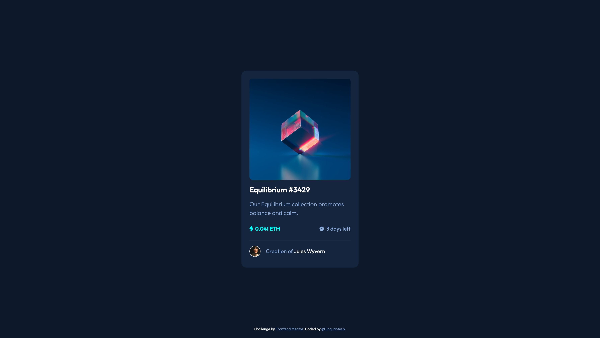

# Frontend Mentor - NFT preview card component solution

This is a solution to the [NFT preview card component challenge on Frontend Mentor](https://www.frontendmentor.io/challenges/nft-preview-card-component-SbdUL_w0U). Frontend Mentor challenges help you improve your coding skills by building realistic projects. 

## Table of contents

- [Overview](#overview)
  - [The challenge](#the-challenge)
  - [Screenshot](#screenshot)
  - [Links](#links)
- [My process](#my-process)
  - [Built with](#built-with)
  - [What I learned](#what-i-learned)
  - [Continued development](#continued-development)
  - [Useful resources](#useful-resources)
- [Author](#author)
- [Acknowledgments](#acknowledgments)

## Overview

### The challenge

Users should be able to:

- View the optimal layout depending on their device's screen size
- See hover states for interactive elements

### Screenshot

### Links

- Solution URL: [solution](https://fascinating-pithivier-e9eb37.netlify.app/)
- Live Site URL: [live site](https://github.com/Cinquantesix/nft-preview-card)

## My process

My objectif (before the start)

I would like to try to:

- Have a better way to use scss features
- Add BEM classes to my html

I'll also try to to the challenge in less than 2 hours.

(after end)

- The development took me 3h
- I had some trouble between grid and flex for some content placement
- I tried to have more reflection before beginning to be sure to develop the better solution. I think it was what I didn't have for last projects and I really underestimated the step.

### Built with

- Semantic HTML5 markup
- CSS custom properties
- SCSS
- BEM Methodology

### What I learned

I learn a lot in BEM and SCSS variable. Also some tricks in Grid and 

### Continued development

I will try to add more variables and automatism fot SCSS to be sure to have less repetition. For BEM, I think I need to have ve more specific with the words a choose for my classes. 

### Useful resources

- [BEM Methodology](https://en.bem.info/methodology/css/) - All the basics you need to begin with BEM.
- [Sass guide](https://sass-lang.com/guide) - What you need to know about SASS/SCSS.
## Author

- Frontend Mentor - [@Cinquantesix](https://www.frontendmentor.io/profile/Cinquantesix)
- Codepen - [@cinquantesix](https://codepen.io/cinquantesix)

## Acknowledgments

Again, thanks [@gmagnenat](https://www.frontendmentor.io/profile/gmagnenat) for his help and good advice.
